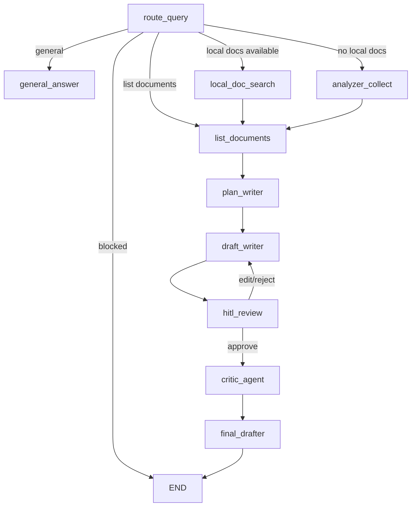

# 🎓 Academic Research Assistant

An **agentic AI assistant** designed to help researchers, students, and academics analyze, retrieve, and synthesize information from large collections of academic documents. Built with **Streamlit**, **LangGraph**, and **OpenAI models**, it supports human-in-the-loop drafting, academic querying, and document-grounded answers.

---

## 👥 Contributors

* Wei-Ling Hung
* Luli Maruyama
* Yushu Gong

---

## 🧩 Problem Statement

Researchers face two persistent challenges:

1. **Information Overload** – Academic materials are scattered across PDFs, Word documents, text files, and online archives (e.g., arXiv), making efficient extraction slow and tedious.
2. **Structured Academic Writing** – Producing well‑structured essays or literature reviews requires careful synthesis across multiple sources.

Existing tools either:

* Provide raw search results with limited synthesis, **or**
* Generate unverified text without human review, risking inaccuracies.

This tool solves both.

---

## ⭐ Why This Matters

* **Efficiency** – Speed up literature review and note extraction.
* **Accuracy** – Incorporates human feedback loops to guide revision.
* **Traceability** – Every answer links back to specific retrieved sources.
* **Scalability** – Works with large local libraries and online retrieval.

---

## ⚙️ Features

* 📄 Upload academic documents (PDF, TXT, DOCX)
* 🔍 AI‑powered search over local and online (arXiv) documents
* 🧠 Structured drafting workflow: **planning → drafting → critique → finalization**
* ✍️ Human‑in‑the‑loop (HITL) revision system
* 🔗 Automatic source linking for transparency
* 🤖 Query orchestration and intent classification

---

## 🚀 Getting Started

### 1. Install dependencies

```bash
pip install -r requirements.txt
```

### 2. Set your OpenAI API key

```bash
export OPENAI_API_KEY="YOUR_KEY_HERE"
```

or create a `.env` file:

```
OPENAI_API_KEY=YOUR_KEY_HERE
```

## 3. Run the Streamlit app

### For either agent:

```bash
cd agent_hitl
streamlit run app.py
```

or

```bash
cd agent_wo_hitl
streamlit run app.py
```

> Both directories have `app.py` and `main.py`. Streamlit uses `app.py` as the entry point for the web interface.

---

## 4. Human-in-the-Loop (HITL) testing

The **agent_hitl** directory contains `backend_agent.ipynb`:

* Human-in-the-loop logic is implemented **in the notebook** (backend) rather than the frontend.
* You can test HITL functionality by running the **last cell** in `backend_agent.ipynb`.

The **agent_wo_hitl** directory is fully automated and does not involve human feedback.

---

### 5. Upload documents and begin querying

Use the sidebar interface to upload PDFs/TXT files.

---

## 6. Langfuse Tracking

We use **[Langfuse](https://www.langfuse.com/)** to monitor and track AI behavior and human-in-the-loop interactions.

* **User queries:** Logged with timestamp, session ID, and workflow stage.
* **AI responses:** Drafts and final answers tracked along with any HITL feedback.
* **Document sources:** Context documents used in responses are recorded for traceability.

**Example usage in `app.py`:**

```python
from langfuse import Client
lf_client = Client(api_key=os.environ.get("LANGFUSE_API_KEY"))

lf_client.track("user_query", properties={
    "query": user_query,
    "stage": st.session_state.get("current_action")
})

lf_client.track("ai_response", properties={
    "response": final_state.get("draft") or final_state.get("final"),
    "feedback": final_state.get("feedback")
})
```

---

## 🧠 How It Works (Architecture)

### High‑Level Flow

1. **Query Routing** – Classifies user intent (`general`, `research`, or `blocked`).
2. **Document Retrieval** – Searches local vectorstore or arXiv.
3. **Planning** – Produces a clean academic outline.
4. **Drafting** – Generates a full academic draft.
5. **Human‑in‑the‑Loop Review** – User approves/edits/rejects.
6. **Critique** – AI evaluates clarity and structure.
7. **Finalization** – Polishes the text.
8. **Storage** – Final result stored back into vectorstore.

---

## 🔀 Mermaid Diagram: Node Flow



---

## 📁 File Structure

```
.
├── README.md
├── requirements.txt
├── agent_hitl/
│   ├── app.py                  # Streamlit UI for HITL
│   ├── backend_agent.ipynb     # Notebook implementing human-in-the-loop
│   └── main.py                 # Core pipeline logic
├── agent_wo_hitl/
│   ├── app.py                  # Streamlit UI without HITL
│   └── main.py                 # Core pipeline logic
```
**Note:** Uploads and vectorstore folders are handled inside each agent directory.

---

## 🛡 Guardrails

* Blocks topics: **politics, religion, violence, illegal activities, personal info**
* Ensures responses remain academic and source‑driven

---

## 🔮 Future Improvements

* Better citation formatting (APA, MLA)
* Support for PubMed, IEEE, Semantic Scholar
* Multi-document comparison & synthesis mode

---

## 📚 References

* [LangChain](https://www.langchain.com/)
* [Chroma Vector Database](https://www.trychroma.com/)
* [Streamlit Documentation](https://docs.streamlit.io/)
